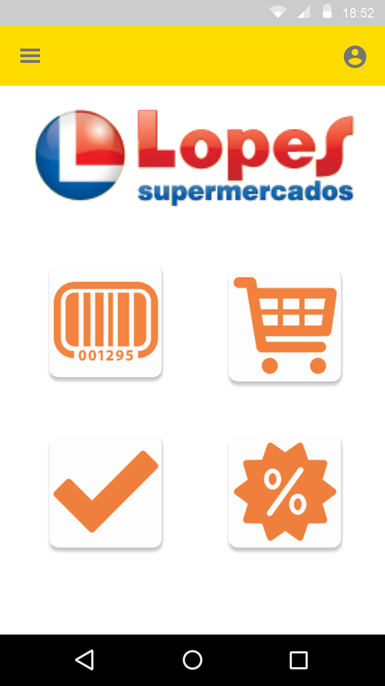
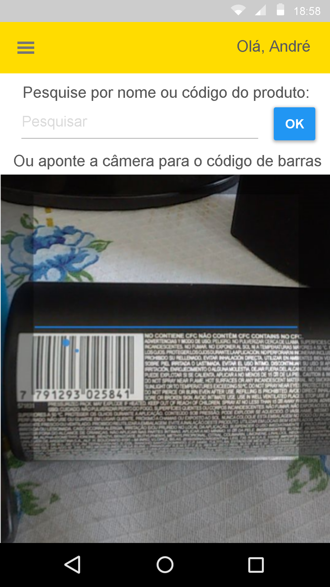
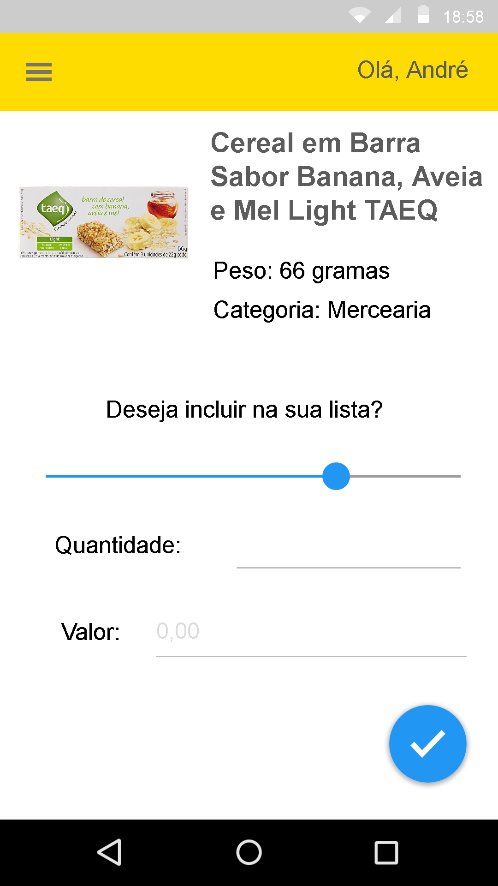
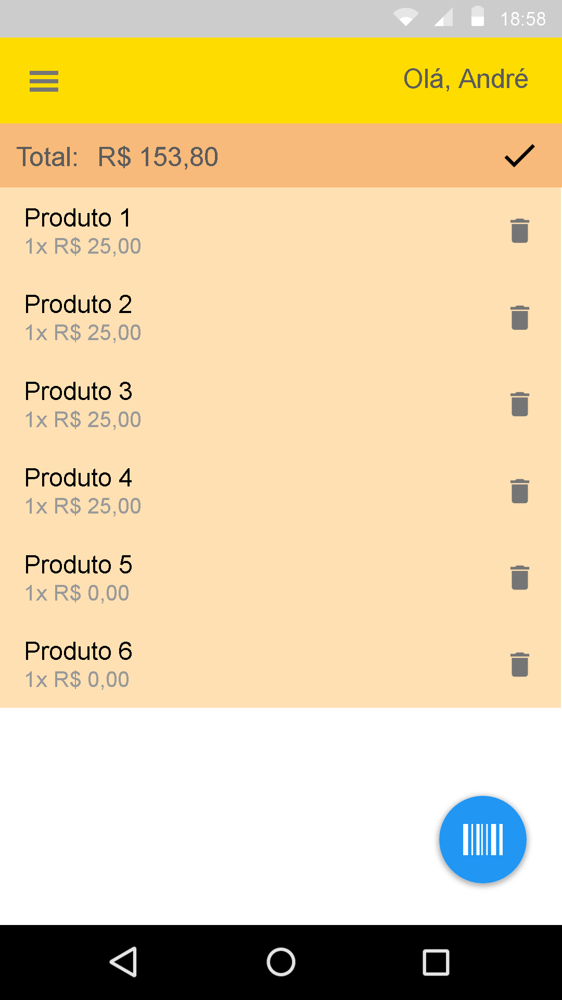
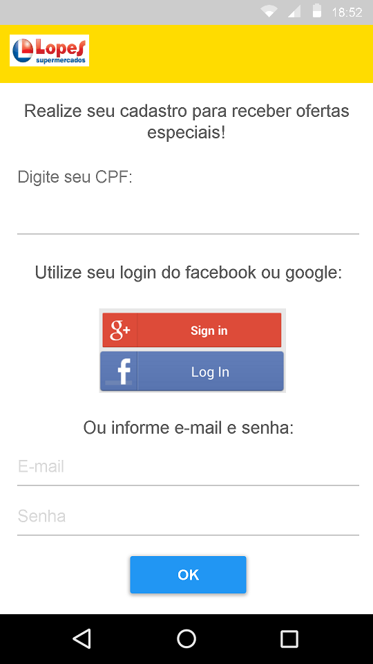

# Leitor App (MVP Histórico - 2015)

Este repositório preserva o código original de um MVP (Produto Mínimo Viável) desenvolvido em 2015 para o setor de varejo, especificamente focado em automação para supermercados. 

## 📸 Registro Visual do Produto
Abaixo, capturas de tela da versão personalizada e implementada para a rede **Lopes Supermercados**, demonstrando a interface e do fluxo de usuário na época.

  
  
  
  
  

## 🚀 Relevância e Impacto
- **Pioneirismo em Scan & Go:** O aplicativo permitia que o cliente realizasse a leitura de códigos de barras via smartphone e gerasse sua própria lista/carrinho, antecipando uma tendência que se tornou padrão de mercado anos depois.
- **Validação e Investimento:** A solução foi validada em ambiente real, atraindo investimento anjo para sua primeira fase de expansão.
- **Arquitetura de Solução:** Focado em UX Mobile, integração com APIs de catálogo de produtos e processamento de imagem em tempo real (2015).

## 🛠️ Detalhes Técnicos
* **Plataforma:** Desenvolvimento focado em dispositivos Android (conforme prints acima).
* **Funcionalidades:** Login social (Google/Facebook), Scanner de barras, Gestão de lista de compras, Notificações e Geo-Fencing, Ofertas personalizadas e Histórico de compras.
* **Status:** Este código está **arquivado** para fins de portfólio e registro histórico de arquitetura.

---
